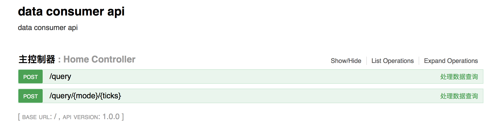

# 数据使用方-数据服务 API 部署文档

```plaintext
数据服务 api 是基于 http[s] 协议的一个数据客户端服务。
它进一步封装了数据服务 SDK，并且提供了一组 restful API 风格的简单接口

版本：1.6.1
```

## 部署

1. 自行搭建服务器
2. 安装 jdk，版本 1.8 +
3. [下载数据服务 jar 包](ud-data-consumer-server-1.6.1.release.tar.gz?raw=true)
4. 解压包文件到指定的路径，并配置参数，具体配置请查看数据服务配置
5. 使用 jdk 运行下载的 jar 包
6. 打开浏览器，输入地址 http://{域名}/swagger-ui.html，看到下图：



## 数据服务配置

数据服务可配置内容：

* account=合约访问账户
* password=合约访问账户密码
* privateKey=合约访问账户私钥
* contractApi=合约 API 地址

```java
account=test
password=passwd
privateKey=5KfU6VKjtXCH1RNvPd7hZxQdi9DfAqtGdYwdK38WT97DqXc5R9v
contractApi=http://preview.unitedata.link/v1
```

数据服务的配置信息通过三种方式获取，优先级依次提高，操作系统环境变量的优先级最高：

* 应用配置文件 application.properties
* 外部应用文件 {绝对路径}/application.properties
* 操作系统环境变量

## 自定义外部配置

外部配置文件使用 peoperties 文件

默认的外部配置文件路径为：/usr/local/config/application.properties

可以通过设置操作系统环境变量 propertiesFileName 来改变外部配置文件的路径

```plaintext
propertiesFileName={绝对路径}/application.properties
```