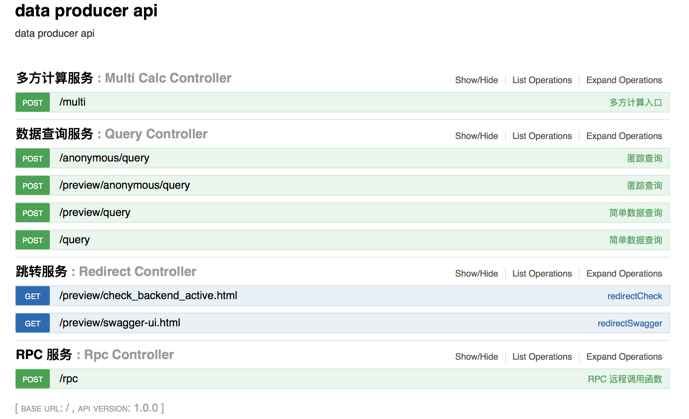

# 数据提供方-数据服务 API 部署文档

```plaintext
数据服务 api 是基于 http[s] 协议的一个数据服务端服务。
它给数据供应方提供了一种方便的内部数据访问的可靠服务，实现了一组以模型计算为核心的数据处理，多方计算混淆数据的业务过程。
并且提供了一组 restful API 风格的简单接口

版本：1.6.1
```

## 部署

1. 自行搭建服务器
2. 安装 jdk，版本 1.8 +
3. 安装 redis 服务
4. [下载数据服务 jar 包](ud-data-producer-server-1.6.1.release.tar.gz?raw=true)
5. 解压包文件到指定的路径，并配置参数，具体配置请查看数据服务配置
6. 使用 jdk 运行下载的 jar 包
7. 打开浏览器，输入地址 http://{域名}/swagger-ui.html，看到下图



## 数据服务配置

数据服务可配置内容：

```java
// 合约访问账户
account=test
// 合约访问账户密码
password=passwd
// 合约访问账户私钥
privateKey=5KfU6VKjtXCH1RNvPd7hZxQdi9DfAqtGdYwdK38WT97DqXc5R9v
// 合约 API 地址
contractApi=http://preview.unitedata.link/v1
// eds 数据桥接网关地址
edsApi=http://unitedata.fudata.info/ud-eds
// eds 数据桥接网关 http[s] 数据访问超时
edsTimeoutRead=1000
// eds 数据桥接网关 http[s] 连接超时
edsTimeoutConnect=1000
// 多方计算服务 api 地址
multiServiceApi=
// 数据仓库
modelDataRepository=default

// redis 访问密码
redisPassword=
// redis 服务器地址
redisHost=localhost
// redis 服务端口
redisPort=6379
// redis 连接超时毫秒
redisTimeout=3000
// 可分配 jedis 实例数量
redisPoolMaxActive=8
// 当 borrow 一个 jedis 实例时，最大的等待时间
redisPoolMaxWait=-1
// 状态为 idle 的 jedis 最大实例数量
redisPoolMaxIdle=8
// 状态为 idle 的 jedis 最小实例数量
redisPoolMinIdle=0
```

数据服务的配置信息通过三种方式获取，优先级依次提高，操作系统环境变量的优先级最高：

* 应用配置文件 application.properties
* 外部应用文件 {绝对路径}/application.properties
* 操作系统环境变量

## 自定义外部配置

外部配置文件使用 peoperties 文件

默认的外部配置文件路径为：/usr/local/config/application.properties

可以通过设置操作系统环境变量 propertiesFileName 来改变外部配置文件的路径

```plaintext
propertiesFileName={绝对路径}/application.properties
```